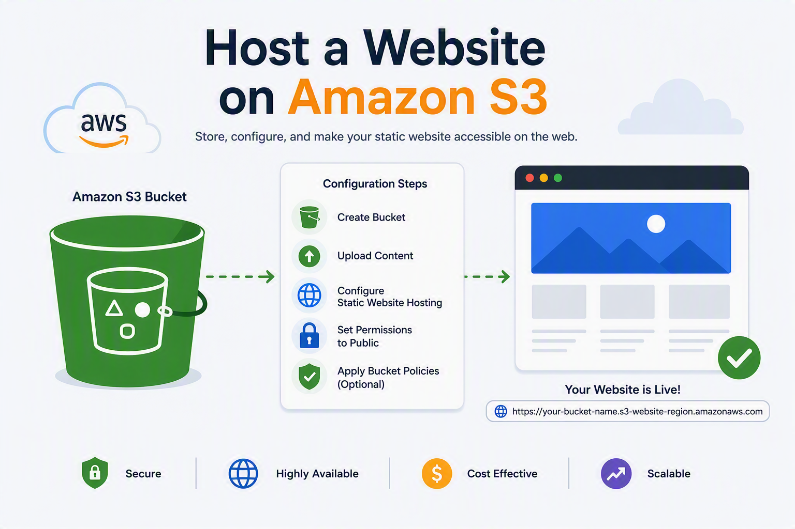

# Host a Website on Amazon S3

<p>
  
</p>


This project demonstrates how to host a static website on Amazon S3 by creating a bucket, uploading website files, and configuring static website hosting.

---

## Create a bucket in Amazon S3

- Pick the closest region to you since it's best practice because it reduces latency and cost.

### Steps

1. Open S3.
2. Create a bucket to store website files.

- Open S3 → Click in Category: **General Purpose Buckets**
- Create Bucket
- Bucket type: **General purpose**
- Bucket name: **website-project-vitor**
- Object Ownsership: **ACLs enabled**

### What's ACL (Access Control List)?

- It's a way to configure permission settings inside a bucket. We enable ACLs so we can control access to our website files later.

- *Turn Off* **Block all public access** in Block Public Access settings for this bucket.
- Click in yellow box saying that you acknowledge that you're turning off.
- Bucket Versioning: **Enable**
- Click in **Create Bucket**.

---

## Upload website content to our bucket

- In Bucket category, click in the bucket *website-project-vitor* that we have created.
- In our bucket, click in the orange button **UPLOAD**.
- Click in **ADD FILES** and import `index.html`.
- After importing `index.html`, click in **ADD FOLDER** and import `images` folder.

> **BOTH ARE STORED INSIDE THIS PROJECT FOLDER**

- Click in the orange button **UPLOAD** to upload everything to our S3 bucket.

---

## Configure a static website on Amazon S3

- In our bucket page, go to section **PROPERTIES**.
- In painel **STATIC WEBSITE HOSTING**, click in **EDIT**.

- Click to **ENABLE** in Static Website Hosting.
- In index document, add the name of the html file, in this case, the name is `index.html`.
- Go down and click in the orange button **SAVE CHANGES**.

---

## Make objects in your S3 bucket profile PUBLIC

- After creating and storing objects in our S3 Bucket, we can scroll down and see the link for our endpoint.
- Despiting turning off **BLOCK ALL PUBLIC ACCESS**, our objects are private by default so we have fix this so we can see access our website though the endpoint.

### Steps

- In **Objects** tab.
- Select the checkbox for both, `indext.html` file and folder `images`.
- Click in the blue button **ACTIONS** and select **MAKE PUBLIC USING ACL**.
- It will ask for confirmation before making the change, just click in **MAKE PUBLIC**.

- Now you can access your website hosted in the S3 bucket.

---

## Bucket Policies

Another way of controlling access to our buckets are **BUCKET POLICIES**.

- Go to tab **Permissions**, in **Bucket Policy** area.
- Click in **Add** and paste this policy written in JSON.

### JSON Policy

```json
{
  "Version": "2012-10-17",
  "Id": "MyBucketPolicy",
  "Statement": [
    {
      "Sid": "BucketPutDelete",
      "Effect": "Deny",
      "Principal": "*",
      "Action": "s3:DeleteObject",
      "Resource": "arn:aws:s3:::website-project-vitor/index.html"
    }
  ]
}
```

- Th*nks to this policy, no one, not ev*n i can delete the file `index.htm*`.

---

## Deleting Resources

- *ince we need to delete our resourc*s, first go to bucket policy and d*lete it.

### Delete Objects

- In***Objects** tab.
- Select both obj*cts, `index.html` and folder `imag*`.
- Click button **Delete**.
- Co*firm it by typing `delete`.
- Clic* in orange button **Delete Objects**.

### Delete Bucket

- In **Buck*ts**.
- Select our bucket.
- Click*button **Delete**.
- Confirm it by*typing `permanently delete`.
- Cli*k in orange button **Delete Objects**.

✅ Everything is deleted.