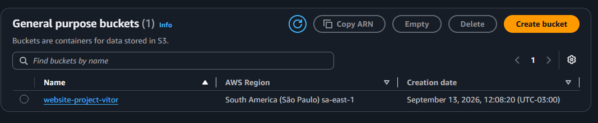
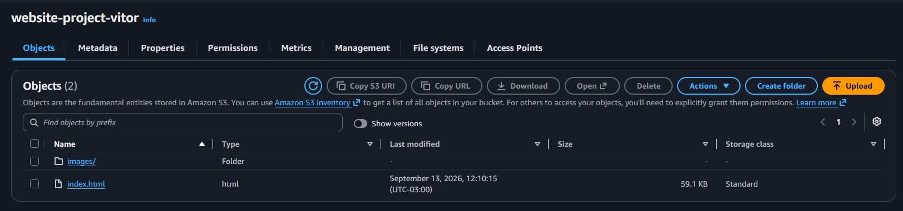
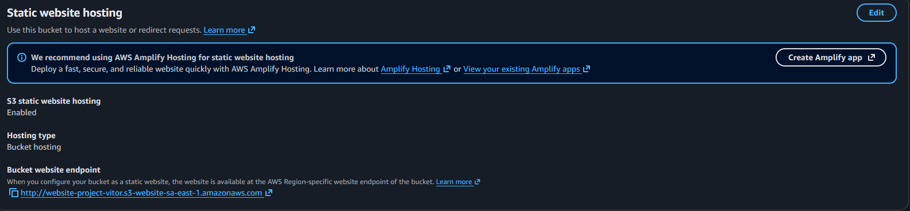
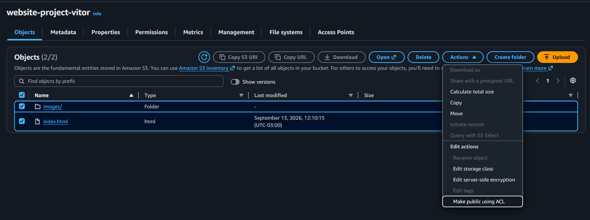
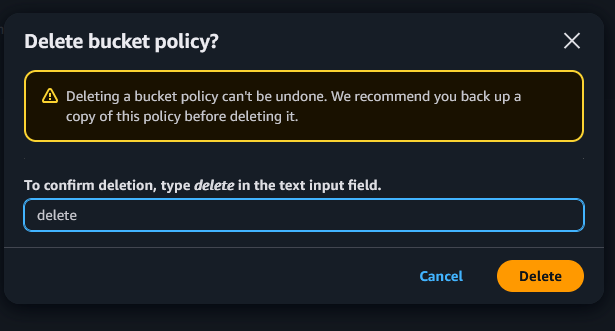
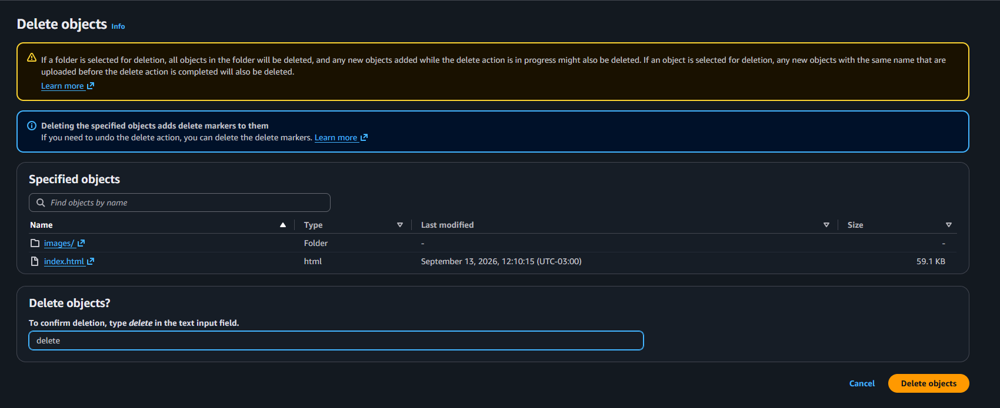
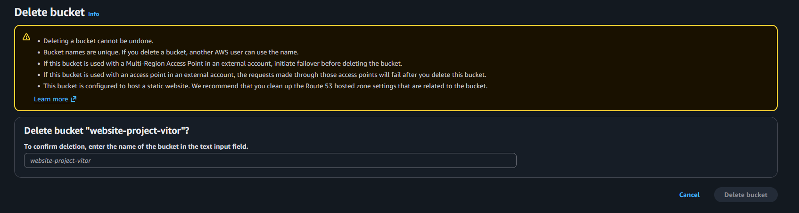

# Host a Website on Amazon S3

<p align="center">
  
</p>

This project demonstrates how to host a **static website using Amazon S3** by creating an S3 bucket, uploading website files, configuring static website hosting, managing public access, and applying a bucket policy.

---

## 📦 Create an S3 Bucket

The first step is to create an S3 bucket to store the website files.

> **Best practice:** Choose an AWS Region geographically close to your users to help reduce latency.

### Steps

1. Open **Amazon S3**.
2. Select **General Purpose Buckets**.
3. Click **Create bucket**.
4. Configure the bucket with the following settings:

* **Bucket type:** General purpose
* **Bucket name:** `website-project-vitor`
* **Object Ownership:** ACLs enabled
* **Block all public access:** Disabled
* **Bucket Versioning:** Enabled

<p>
  
</p>

### What is an ACL?

An **Access Control List (ACL)** is a mechanism used by Amazon S3 to manage access permissions for buckets and objects.

For this project, ACLs were enabled so that object-level public access could be configured later.

> **Note:** For modern AWS architectures, AWS generally recommends disabling ACLs and using IAM and bucket policies to manage access whenever possible.

### Block Public Access

S3 buckets are private by default.

For this project, **Block all public access** was disabled so the website could be accessed publicly through the S3 website endpoint.

When disabling this option, AWS displays a warning requiring confirmation that public access may be granted.

---

## 📤 Upload Website Content

After creating the bucket, the website files need to be uploaded.

### Steps

1. Open the `website-project-vitor` bucket.
2. Go to the **Objects** tab.
3. Click **Upload**.
4. Click **Add files** and upload:

```text
index.html
```

5. Click **Add folder** and upload the:

```text
images/
```

folder.

The bucket structure should look similar to:

```text
website-project-vitor/
│
├── index.html
│
└── images/
    ├── image1.png
    ├── image2.png
    └── ...
```

> **Note:** S3 does not have traditional folders. `images/` is a prefix used to organize objects.

<p>
  
</p>

Click **Upload** to upload the website content to the bucket.

---

## 🌐 Configure Static Website Hosting

Amazon S3 can be used to host static websites directly from a bucket.

### Steps

1. Open the `website-project-vitor` bucket.
2. Go to the **Properties** tab.
3. Find **Static website hosting**.
4. Click **Edit**.
5. Enable **Static website hosting**.
6. Under **Index document**, enter:

```text
index.html
```

7. Click **Save changes**.

<p>
  
</p>

After enabling static website hosting, S3 provides a **website endpoint** that can be used to access the website.

---

## 🔓 Make Website Objects Public

Disabling **Block all public access** does not automatically make the objects inside the bucket public.

Additional permissions are required.

For this project, I used **S3 object ACLs** to make the website content publicly accessible.

### Steps

1. Go to the **Objects** tab.
2. Select the `index.html` object.
3. Select the website image objects inside the `images/` prefix.
4. Click **Actions**.
5. Select **Make public using ACL**.
6. Confirm by clicking **Make public**.

<p>
  
</p>

After the objects have public read access, the website can be accessed through the S3 website endpoint.

---

## 🔐 Bucket Policies

Another way to control access to S3 resources is through **Bucket Policies**.

A bucket policy is a JSON-based resource policy that defines which actions are allowed or denied for specific resources and principals.

For this project, I created a policy that prevents deletion of the `index.html` object.

### JSON Policy

```json
{
  "Version": "2012-10-17",
  "Id": "MyBucketPolicy",
  "Statement": [
    {
      "Sid": "DenyIndexDeletion",
      "Effect": "Deny",
      "Principal": "*",
      "Action": "s3:DeleteObject",
      "Resource": "arn:aws:s3:::website-project-vitor/index.html"
    }
  ]
}
```

### What does this policy do?

The policy explicitly denies the `s3:DeleteObject` action for:

```text
arn:aws:s3:::website-project-vitor/index.html
```

This demonstrates an important AWS security concept:

> **An explicit Deny takes precedence over an Allow.**

The policy prevents the object from being deleted while the policy remains in place.

---

## 🗑️ Delete the Resources

After completing the project, I removed the AWS resources to avoid unnecessary charges.

### Remove the Bucket Policy

Before deleting the website content, the bucket policy must be removed.

### Steps

1. Open the bucket.
2. Go to **Permissions**.
3. Find **Bucket policy**.
4. Delete the policy.

<p>
  
</p>

---

## 🧹 Delete the Objects

After removing the bucket policy, the website objects can be deleted.

### Steps

1. Open the **Objects** tab.
2. Select `index.html`.
3. Select the objects inside the `images/` prefix.
4. Click **Delete**.
5. Confirm the deletion.
6. Type:

```text
delete
```

7. Click **Delete objects**.

<p>
  
</p>

### ⚠️ S3 Versioning

Because **Bucket Versioning** was enabled, deleting an object may create a **delete marker** instead of permanently removing all versions of that object.

If the bucket cannot be deleted, all object versions and delete markers may need to be removed first.

---

## 🗑️ Delete the S3 Bucket

Once all objects and versions have been removed, the bucket can be deleted.

### Steps

1. Go to **Buckets**.
2. Select `website-project-vitor`.
3. Click **Delete**.
4. Confirm by typing:

```text
permanently delete
```

5. Click **Delete bucket**.

<p>
  
</p>

---

# ✅ Project Completed


