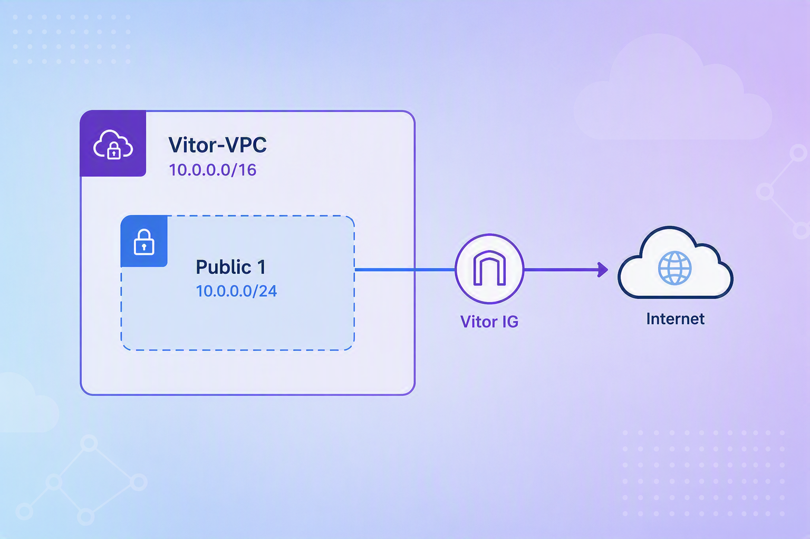

# Build a Virtual Private Cloud (VPC)

<p align="center">
  
</p>

A VPC is a logically isolated network inside AWS where resources such as EC2 instances, databases, and load balancers can be deployed securely.

Some key concepts learned during this project:

- VPCs are isolated sections of the AWS Cloud that help keep AWS resources private and secure.
- AWS automatically creates a **default VPC** when an account is created.
- The default VPC allows resources such as EC2 instances and RDS databases to be launched immediately without creating a custom network.
- When creating a custom VPC, an **IPv4 CIDR Block** must be defined. This CIDR block determines the range of IP addresses available for resources deployed inside the VPC.

---

## 🌐 Understanding VPC Networking

Before creating a VPC, it is important to understand a few networking concepts.

### What is an IP Address?

An **IP address (Internet Protocol Address)** is a unique identifier assigned to a device on a network.

Just as a physical address identifies a house in a city, an IP address identifies a resource on a network.

Example:

```text
10.0.0.15
```

### What is IPv4?

**IPv4 (Internet Protocol Version 4)** is the most commonly used IP addressing system.

IPv4 addresses consist of four numbers separated by periods.

Example:

```text
10.0.0.1
```

AWS VPCs commonly use private IPv4 ranges such as:

```text
10.0.0.0/16
172.16.0.0/12
192.168.0.0/16
```

### What is a CIDR Block?

**CIDR (Classless Inter-Domain Routing)** is a notation used to define a range of IP addresses.

Example:

```text
10.0.0.0/16
```

The `/16` indicates how much of the IP address represents the network portion.

This CIDR block provides approximately:

```text
65,536 IP addresses
```

that can be allocated within the VPC.

### VPC Analogy

```text
VPC            = A city
Subnet         = A neighborhood
IP Address     = A house address
CIDR Block     = A range of houses
Internet Gateway = The road connecting the city to the outside world
```

---

## 🏗️ Create an Amazon VPC

The first step is to create a custom VPC.

### Steps

1. Open **Amazon VPC**.
2. Select **Your VPCs**.
3. Click **Create VPC**.
4. Under **VPC Settings**, configure:

- **Resources to create:** VPC only
- **Name tag:** `Vitor-VPC`
- **IPv4 CIDR block:** IPv4 CIDR manual input
- **IPv4 CIDR:** `10.0.0.0/16`

5. Click **Create VPC**.


### Why use 10.0.0.0/16?

The CIDR block:

```text
10.0.0.0/16
```

provides a large private IP range that can later be divided into multiple subnets.

---

## 📍 Create a Public Subnet

Subnets divide a VPC into smaller network segments.

### Steps

1. Open **Subnets**.
2. Click **Create subnet**.
3. Configure:

- **VPC ID:** `Vitor-VPC`
- **Subnet name:** `Public 1`
- **IPv4 subnet CIDR block:** `10.0.0.0/24`

4. Click **Create subnet**.

<p>
  ./prints_projeto_vpc/project_print_2.png
</p>

### Configure Public IP Assignment

1. Select the subnet.
2. Click **Actions**.
3. Select **Edit subnet settings**.
4. Enable:

```text
Auto-assign public IPv4 address
```

5. Click **Save**.

<p>
  ./prints_projeto_vpc/project_print_3.png
</p>

### What is a Subnet?

Subnets are subdivisions of a VPC, just like neighborhoods are subdivisions of a city.

Example:

```text
VPC CIDR:     10.0.0.0/16
Subnet CIDR:  10.0.0.0/24
```

The subnet receives a smaller portion of the VPC's available address space.

### Public vs Private Subnets

#### Public Subnet

A public subnet:

- Can communicate directly with the internet.
- Has a route to an Internet Gateway.
- Typically hosts web servers and load balancers.

#### Private Subnet

A private subnet:

- Cannot be accessed directly from the internet.
- Is commonly used for databases and backend applications.
- Requires a NAT Gateway if outbound internet access is needed.

---

## 🌍 Create an Internet Gateway

### What is an Internet Gateway?

An **Internet Gateway (IGW)** is a VPC component that allows communication between resources inside a VPC and the public internet.

Think of an Internet Gateway as the highway connecting your city (VPC) to the outside world.

### Steps

1. Open **Internet Gateways**.
2. Click **Create internet gateway**.
3. Configure:

- **Name tag:** `Vitor IG`

4. Add the tag:

```text
Key: Name
Value: Vitor IG
```

5. Click **Create internet gateway**.


1. Select **Vitor IG**.
2. Click **Actions**.
3. Select **Attach to VPC**.
4. Select:

```text
Vitor-VPC
```

5. Click **Attach Internet Gateway**.


Creating and attaching an Internet Gateway does not automatically provide internet access.

A route table must tell AWS where internet-bound traffic should be sent.

### Steps

1. Open **Route Tables**.
2. Select the route table associated with **Vitor-VPC**.
3. Open the **Routes** tab.
4. Click **Edit routes**.
5. Click **Add route**.

Configure:

```text
Destination: 0.0.0.0/0
Target: Vitor IG
```

6. Click **Save changes**.


0.0/0 mean?

```text
0.0.0.0/0
```

represents all IPv4 addresses.

This route tells AWS:

> Any traffic that is not intended for resources within the VPC should be sent to the Internet Gateway.

---

# ✅ Project Completed

